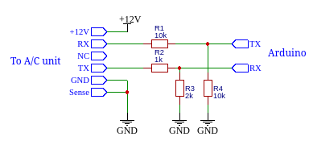

# hi-arduino
Control your Hitachi HVAC with an arduino through the H-LINK port. This project is written for an Arduino 33 IOT and requires the libraries WiFiWebServer and PubSubClient. You can also use hi_link.h and hi_link.cpp in your own project.

# Wiring
 Locate the H-link connector header on the interior unit board. This information can be found on the service manual for your specific model or directly printed on the unit cover. It is a 6 pin connector:
 1. +12V: Can be used to power the arduino
 2. RX of the A/C unit <> TX of the arduino
 3. Not connected
 4. TX of the A/C unit <> RX of the arduino
 5. Ground
 6. Sense: pulled-up to +5V inside the A/C unit. It must be connected to ground to work
The A/C unit is working with 5V level while the Arduino 33 IOT works with 3.3V. You should use a level shifter to adapt the levels. You can also try this crappy schematic:

 
# Configuration
You need to create a file secret.h containting your wifi ssid and password and MQTT server using the template template_secrets.h

# H-link Protocol description
This component communicates with an Hitachi A/C through the H-link protocol (also called Hi-Kumo). It uses UART communication with a baud rate of 9600, 8 data_bits, ODD parity and 1 stop bit. The Arduino send commands to read or modify internal parameters of the A/C. The A/C send back a message containing the value requested or an acknoledgment that the value has been modified.
The messages are written using only ascii characters and always ends with a carriage return (0x0D)

Commands from the Arduino to the A/C:
 - Read the parameter at the [address]: "MT P=[address] C=[checksum]\r"
     [address] is 4 hexadecimal characters
     [checksum] is 4 hexadecimal characters: FFFF minus the sum of all pairs of characters in [address]
 - Set the parameter at the [address] with the value [data]: "ST P=[address],[data] C=[checksum]\r"
     [address] is 4 hexadecimal characters
     [data] is 2, 4, or 20 hexadecimal characters depending on the address
     [checksum] is 4 hexadecimal characters: FFFF minus the sum of all pairs of characters in [address] and [data]

Answer from the  A/C:
 - Error: "NG TODO
 - Read successful: "OK P=[data] C=[checksum]\r"
   [data] is 2, 4, or 20 hexadecimal characters depending on the address
   [checksum] is 4 hexadecimal characters: FFFF minus the sum of all pairs of characters in [data]    
 - Acknowledge modified parameter: "H~ TODO

The list of the valid address is described hereunder with their signification when it is known:
 - 0000-RW: Power state 0=OFF 1=ON
 - 0001-RW: Operation mode 0x0010=hot 0x0020=dry 0x0040=cool 0x0050=fan 0x8000=auto
 - 0002-RW: Fan speed 0=auto 1=high 2=medium 3=low 4=Silent
 - 0003-RW: Target termperature in °C
 - 0005-RO: unknown, always 0x7E=0b01111110
 - 0006-RO: Control via remote control permission, 00 = all settings allowed 01 = all settings prohibited (not tested !)
 - 0007-RW: unknown, always 00, maybe for swing mode
 - 0008-RO: unknown, always 00
 - 0009-RO: unknown, always 00
 - 000A-RO: unknown, always 00
 - 0011-RO: unknown, always FF
 - 0012-RO: unknown, always FF
 - 0013-RO: unknown, always 03
 - 0014-RO: unknown, always 00
 - 0100-RO: Current indoor temperature in °C
 - 0101-RO: unknown, always 0x7E=0b01111110
 - 0102-RO: Current outdoor temperature in °C
 - 0201-RO: unknown, always 0000
 - 0300-WO: unknown, write only, 0000=normal 0040=absence
 - 0301-RO: Active status 0000=Stand-by FFFF=Active
 - 0302-RO: Filter status 0=OK 1=BAD
 - 0304-RO: Absence 0=disabled 80=activated
 - 0800-WO: Beep (TBC), write only, 00=no beep 07=beep
 - 0900-RO: model, always 5241442D323551504220 for me --> RAD-25QPB in ascii
 
